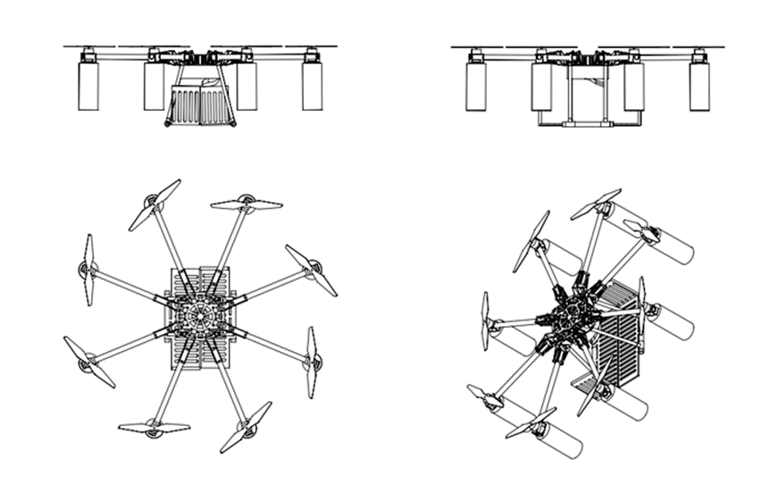
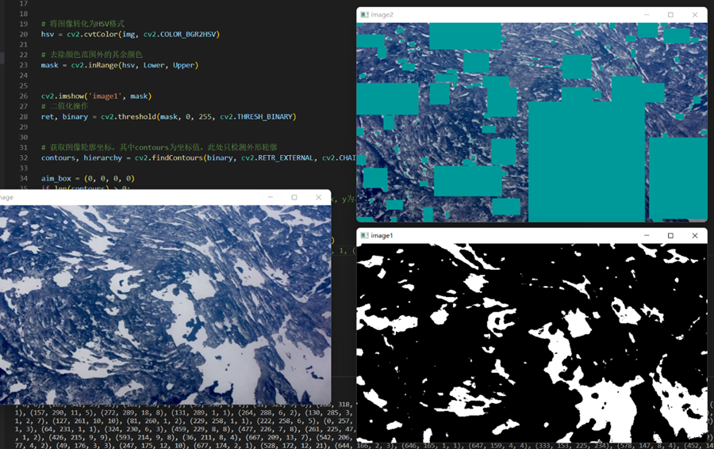
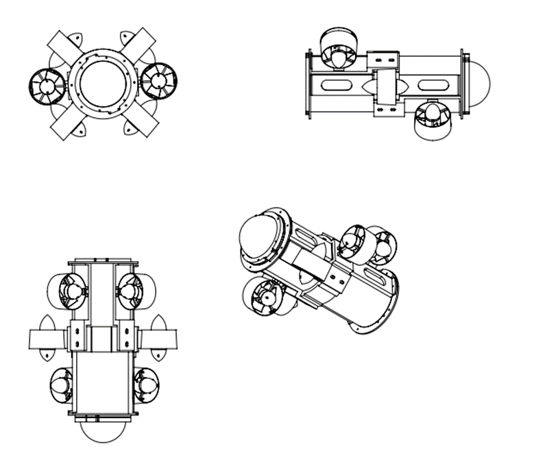
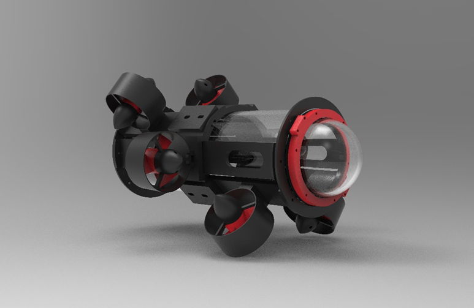

水空两栖探测航行器分为两部分，分别是水下观测的自主遥控水下机器人（ARV）以及携带ARV飞抵目标海域的八旋翼无人机。通过八旋翼的绞盘收纳装置实现ARV的自主收纳与释放过程。可对极地季节性冰区、北温带海冰等人类及传统水下观测航行器难以抵达的海域进行海空一体探测。

## 演示视频

## 项目背景

现阶段，物联网快速发展，全自动化日益普及，完全无人探测的实现指日可待。与此同时，针对复杂水域实现空中运动的需求也逐渐增强。在此方面，市面上目前的同类型产品都能够实现一定范围内的运动、探测等功能，一些相关无人机也曾对水空两栖探测进行过探索，例如：ETH Zurich所生产的机器人Dipper能够实现在空中和水下的受控运动，兼具飞行和潜水功能的无人机Naviator，以及填补了国内大型水空两用无人机空白的——中国上海优伟斯智能系统有限公司所生产的机器人U650。

然而，在一定程度上，它们都或多或少地存在着一些局限性与不足，如：体积较大，在探测有障碍的海域时行动不便、动作不灵活，性能不全面，实现两栖运动功能的同时无法实现探测目标，以及其最主要的局限性：运动基本仅针对单一目标领域，导致对复杂环境的处理能力不强。而随着技术的发展与能源需求的提高，极地地区的科研勘测意义愈发重要。极地地区多为冰区，海域情况复杂，水面多浮冰，水下多陡崖、暗流，出现紧急情况的概率大。而在现实情况中，极地地区的海域受天气与洋流的影响，更加变化莫测，这也对适用于极地勘测的两栖探测机器人的设计提出了更高的要求。因此，我们将构建一个水空两栖航行器对该问题进行优化和解决，这有望广泛应用于海上搜救、海洋科学等领域；实现对特定海区同时进行水空探测的任务；适配于冰层、冰下等复杂环境中的作业任务。

## 具体内容：

本产品面向极地季节性冰区的探测工作，是一种能够实现“空中-水上-水下”一体化探测的分体式两栖航行器，其目的是实现“水空两栖”，实现穿越浮冰较多、小型无人船难以通行的复杂冰区，并于冰区内部释放自主水下航行器，进行冰下光场的数据搜集、探测冰层、救援等任务，让两个分体的部分发挥“一加一大于二”的效果。其分体式的设计与高度定制化的飞控系统使其更易操控、调试，并且面对复杂环境时的鲁棒性更强。同时，高开发程度的系统与大部分开源并且互相独立的组件也让其功能更加灵活，降低了二次开发的门槛，为进一步发展提供了更广阔的可能性。

项目的核心技术及特色为：分体式结构设计与控制，八旋翼无人机搭载小型自主/遥控水下航行器实现水下航行器的释放、自主回收等动作。从控制上，设计要求无人机与水下航行器进行相互协同，进行自主的协同工作。例如无人机实时将冰区整体结构发送至水下航行器，帮助水下航行器进行水下定位与导航等工作。为分体式控制领域提供了更为灵活的解决方案。

**创新点：**

八旋翼无人机与自主/遥控水下航行器（ARV）分体式设计，水空两栖、应对场景灵活。并且ARV动力结构采用六自由度全矢量布局，机动灵活。

**系统性能和安全性：**ARV与八旋翼无人机采用独立的供电系统及控制系统，保证了整体系统的鲁棒性。并且ARV与无人机采用ROS系统进行协同控制，确保“分体如一体”。

现实及潜在应用：可用于极地季节性冰区及北温带海冰环境的水下探测任务。

## 设计方案

### 无人机设计

#### 无人机结构设计

整机采用八旋翼驱动方式：首先因为其在结构上高度对称，可实现在空中不考虑所面对方向实现全方位移动；并且八轴会给整套系统提供更大的升力，可在进行ARV水质监测作业等负重作业环境中中实现高负载的要求；最后由于考虑到极地强风的特殊地理环境，为保证整套系统的的稳定性，因此在该项目中采用八旋翼无人机。

整机采用全碳纤维机架结构，在保证整体轻量化的同时还保证了机体结构的强度和稳定性，采用Sunnysky朗宇X4110S无刷电机啊搭配DJI1555桨叶，单电机最大功率达到500W以上，实现全机负载12Kg，搭配轻量化ARV可实现大部分特殊场景作业。

为实现无人机部分在水面部分的悬浮，在每个桨叶下面配备浮漂，并且根据物理场仿真验证，浮漂对机体的升力影响小于10%，并且将浮漂设置在无人机臂边侧，当在极地环境机体受到浮冰碰撞时，浮漂也会抵挡部分冲击力防止损伤到重要机体结构。并且根据力学仿真分析，边侧浮漂当受到浪等波动时，其拥有自适应姿态反馈调节以保证机体在水面上的稳定性。

#### 无人机电控设计

首先，对于重要的操控部件遥控器，本产品使用RadioMaster开源遥控器，在无人机模式，遥控器连接八旋翼无人机的可编程的飞控，手动操控无人机的飞行。当无人机降落到水面之后，可以仅仅通过遥控器信道的切换，转换至水下航行器的控制模式。与此同时，考虑到电信号在水中的传播衰减很大，水下航行器的接收机被安装在浮在水面的无人机上，并通过脐带缆与水下航行器相连。

对于地面基站，其主要作用有三点：分别是任务规划、操作控制和显示记录。其中，任务规划功能主要包括飞行航路规划与重规划、任务载荷工作规划与重规划；操作控制功能主要包括起降操纵、飞行控制操作、任务载荷操作、数据链控制，实现了高度自动化的功能；而显示记录功能主要包括飞行状态参数显示与记录、航迹显示与记录、载荷信息显示与记录。此外，通过地面站的控制，水下机器人也能实现图传功能。

针对复杂冰区自动化进行水面着陆的特殊要求，团队使用OpenCV自主开发了一款能够自动识别冰区与海面的全自动视觉识别系统。利用冰面反射率较海面更高的特点，视觉识别系统灵敏度高，鲁棒性强，能成功完成自动海上着陆的引导要求。

### 冰区水下航行器设计

#### 水下航行器结构设计

整机采用六推进器实现六自由度全矢量布局，推进器方面选择强度高、耐腐蚀、耐海水的T60水下推进器，单个电机功率可达到300W。

在机身材料方面采用全3D打印（ABS）制作，使得保证强度的情况下，实现ARV轻量化进行作业任务，也可减轻对无人机携带的负担，以此提高整体结构的工作覆盖范围。

为适应极地低温环境，将ARV的电子仓和电池仓合并，使得树莓派等电子元件在工作时的产热将提供到环境中保证电池的正常放电，并且在ARV防水仓内壁填充了高性能发泡材料，减少外界与防水仓内的热交换。为防止电池电能释放效率过低，在仓内加装了温度传感器以及电加热片，当温度过低时，将自动开启电加热片以保证电能的释放。

在结构设计方面采用环绕式支架布局，并且在中段设置了可微调距离的套环，可实现自适应安装，保证整机的抗破坏性以及结构强度。并且环绕式支架结构可在后期需要安装抓手以及探测传感器时，在预留位置进行安装，其拓展性和开放性良好，并且紧凑式布局将整机的尺寸压缩到了300\*300\*200内，可通过狭小冰裂缝区  
域进行特殊地形的观测任务等。

